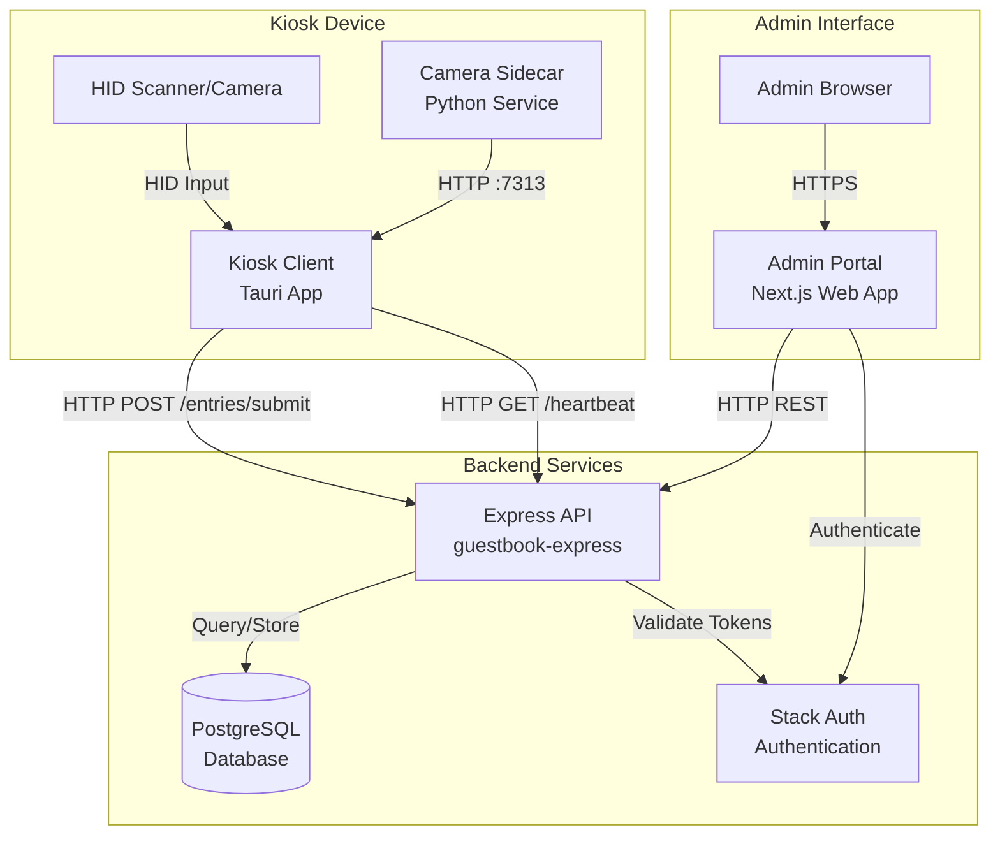

This page provides a system-level architecture overview of the Guestbook platform. The admin portal is one component of a three-part system.

## System architecture

The Guestbook platform consists of three main components:

### Component responsibilities

1. **Kiosk Client** (`guestbook-client`): Tauri-based desktop application that runs on kiosk hardware, captures guest entries via HID devices or camera, and submits them to the backend API.

2. **Backend API** (`guestbook-express`): Express.js REST API that manages entries, devices, guests, organizations, and user authentication. Uses PostgreSQL for data storage and Stack Auth for authentication.

3. **Admin Portal** (`guestbook-admin-portal`): Next.js web application that provides administrators with a UI to view entries, manage devices, export data, and configure organizations.

## Admin portal architecture (this repository)

### Components

- **Admin portal UI**: Next.js App Router application in `app/`
- **Shared UI components**: `components/` (tables, navigation, forms)
- **API client**: `lib/api.ts` and `lib/useApi.ts`
- **Auth integration**: Stack Auth (`@stackframe/stack`)
- **Admin-only API routes**: `app/api/*` for health, contact form, setup script

### Data flow (high-level)

1. The user signs in via Stack Auth
2. The portal fetches data from the backend API (`NEXT_PUBLIC_API_BASE_URL`)
3. Data is rendered in tables and export flows
4. Admin actions (update, retire, create) call the backend API

### Trust boundaries

- The portal is a web app running in the browser
- The backend API is the system of record for entries, devices, guests, orgs, and users
- Entry data can contain PII—treat it as sensitive by default
- Authentication is handled by Stack Auth; the portal never sees passwords
- Device authentication uses separate tokens managed by the backend

## Component interactions

### Kiosk → Backend
- Device authentication via device tokens
- Entry submission via `POST /api/v1/entries/submit`
- Heartbeat monitoring via `GET /api/v1/devices/heartbeat/:id`

### Admin Portal → Backend
- User authentication via Stack Auth (Bearer tokens)
- REST API calls for data retrieval and management
- All requests require valid authentication tokens

### Backend → Database
- PostgreSQL with versioned device attributes (`device_versions` table)
- Entry tracking linked to guests, devices, and timestamps
- Organization management with role-based access control

### Backend → Stack Auth
- User authentication and authorization
- Role-based access control (Superadmin, Owner, Manager, Viewer)
- Organization membership management
